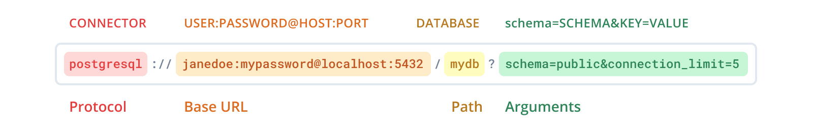

## Aplicação-CRUD - Engenharia de Software II

### Sobre o projeto

<p>
  Esse projeto é um CRUD de Filmes, desenvolvido para a disciplina de Engenharia de Software II
</p>

### Dependência

- [NodeJS](https://nodejs.org/en/)

### Instalação

1. Após clonar o projeto na máquina, navegue até a pasta "client" e execute o comando abaixo para instalar as dependências:

```console
npm install
```

2. Após instalar as dependencias do Client, navegue até a pasta "server" e utilize o mesmo comando do passo anterior.

3. Após as dependências terem sido instaladas, ainda na pasta "server", acesse a pasta "prisma" e no arquivo "schema.prisma" altere o provedor e a url para a do seu banco de dados, exemplo:



4. Após as dependências terem sido instaladas, ainda na pasta "server" execute o BackEnd:

```console
npm start devStart
```

5. Após isso, ja na pasta "client" execute o FrontEnd:

```console
npm start
```

6. E pronto! O projeto já está rodando!